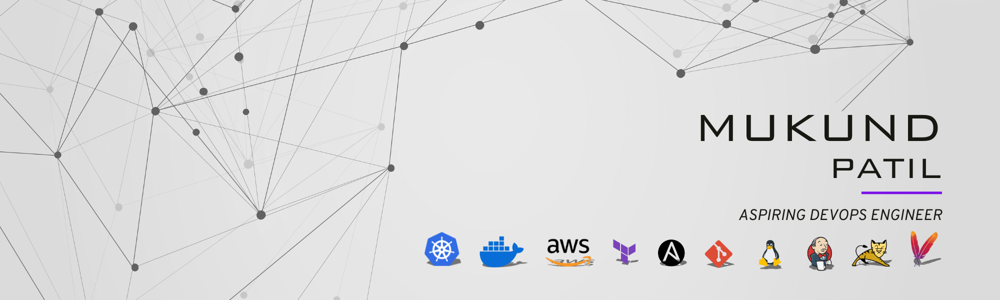

<h1 align="center">Hey Everyone 👋, I'm Mukund Patil</h1>

  

<h3 align="center">DevOps and Cloud Enthusiast skilled in AWS, Docker, Kubernetes, Terraform, Jenkins, and Ansible</h3>

  
  

  

- 📚 Check out my GitHub for crisp, structured notes on DevOps, Cloud, and more!
- 📫 How to reach me: mukundpatil2001@gmail.com
- 📄 Learn more about my skills and projects on [LinkedIn](https://www.linkedin.com/in/mukund-p/)

---

## 🛠️ Tools & Technologies

  
  
  
  
  
  
  
  
  
  
  
  
  
  
  
  
  
  
  
  
  
  
  
  
  
  
  
  
  

---

<!-- Top Languages Card -->
<picture>
  <source srcset="https://github-readme-stats.vercel.app/api/top-langs?username=mukund-p&show_icons=true&locale=en&layout=compact&theme=github_dark&hide_border=true" media="(prefers-color-scheme: dark)" />
  <source srcset="https://github-readme-stats.vercel.app/api/top-langs?username=mukund-p&show_icons=true&locale=en&layout=compact&theme=default&hide_border=true" media="(prefers-color-scheme: light)" />
  
</picture>

<!-- GitHub Stats Card -->
<picture>
  <source srcset="https://github-readme-stats.vercel.app/api?username=mukund-p&show_icons=true&locale=en&theme=github_dark&hide_border=true" media="(prefers-color-scheme: dark)" />
  <source srcset="https://github-readme-stats.vercel.app/api?username=mukund-p&show_icons=true&locale=en&theme=default&hide_border=true" media="(prefers-color-scheme: light)" />
  
</picture>

---

### 🔥 GitHub Contribution Streak

---

## 📚 Certifications

- 🛡️ [AWS DevOps Masterclass - TrainWithShubham](https://www.trainwithshubham.com/share-certificate?serialno=991Q6GHU)
- 📜 [Cloud Computing and DevOps A to Z - Google Developer Student Clubs](https://www.cert.devtown.in/verify/Z1PW9qG)
- 🎯 [Getting Started with DevOps - GUVI](https://drive.google.com/file/d/18OKlmD2uPuxNiPcHH7tTFI9_CVQzW6W9/view)

---

## 🛠️ Skills & Tools

- **Cloud:** AWS (EC2, S3, VPC, IAM, RDS, EFS, SNS, CloudTrail, CloudWatch)
- **DevOps Tools:** Docker, Kubernetes, Terraform, Jenkins, Ansible
- **CI/CD:** Git, GitHub, Apache Maven
- **Web Servers & Proxies:** Apache Tomcat, Apache HTTPD, NGINX, IIS Web Server
- **Storage:** AWS S3, EFS, EBS, RDS
- **Scripting:** Shell Scripting, YAML, Groovy
- **Operating Systems:** Linux (RHEL, Ubuntu, CentOS), Windows
- **Monitoring:** AWS CloudWatch, CloudTrail
- **Load Balancers:** AWS Load Balancers

---

## 🏆 Achievements

- Automated 90% of Java application deployment steps through CI/CD pipelines.
- Reduced deployment time and eliminated manual errors via Maven, Jenkins, Docker, and Ansible automation.

---

## 🚀 Projects

### Automated Deployment of Java Apps using Jenkins & Docker
**Tools Used**: Git, Maven, Jenkins, Docker, Ansible
- Configured Jenkins to trigger builds upon code changes in GitHub.
- Used Maven for dependency management and application packaging.
- Built and pushed Docker images to DockerHub for containerized deployment.
- Automated deployment using Ansible playbooks for efficient infrastructure management.
- Deployed the application inside a Tomcat container, ensuring scalability and efficiency.

---

## 💬 Soft Skills

- Attention to Detail
- Continuous Learning
- Problem Solving
- Collaboration

---

⚡ **Fun fact:** I believe in "Automate Everything" to improve system reliability and efficiency.

---

<h2 align="center"> Thank you for visiting my GitHub! 🌟 </h2>

<h3 align="center"> Let's connect, collaborate, and grow together! </h3>

